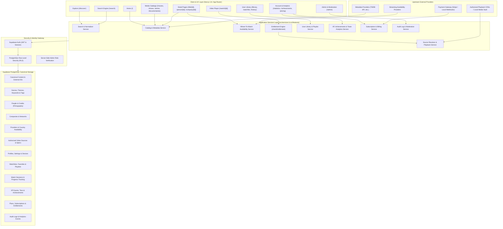
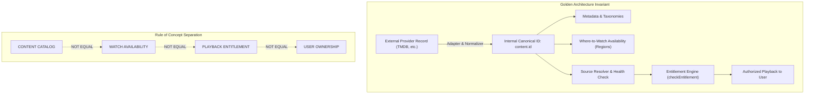
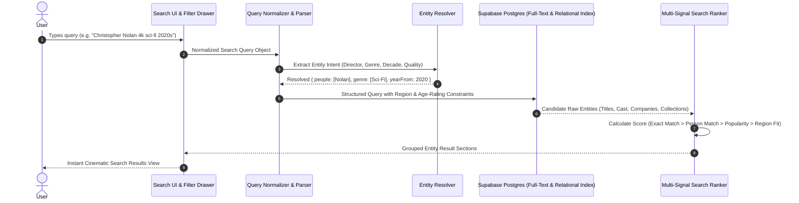
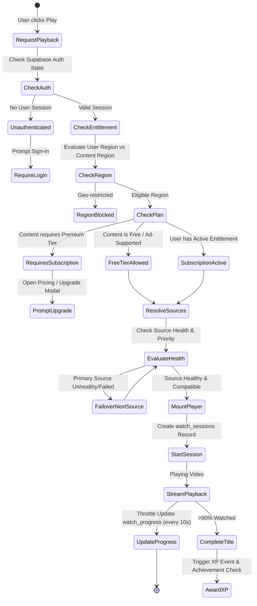
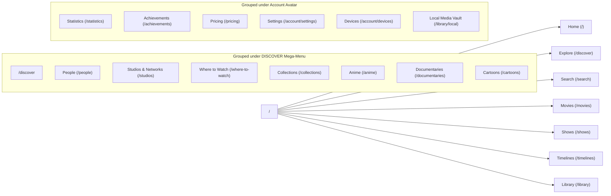
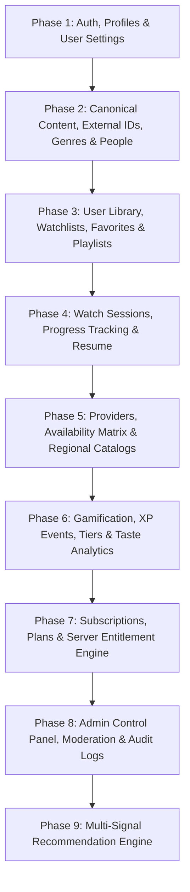

# LANTAWON LANG — COMPLETE ARCHITECTURE & SYSTEM GRAPH (GRAPHIFY)

> **Architectural Memory & Visual Graph Specification**  
> This document maps all relationships, data flows, entity dependencies, state machines, and system layers of Lantawon Lang into visual graph models to guarantee zero hallucination during development.

---

## 1. END-TO-END SYSTEM TOPOLOGY

---

## 2. COMPLETE DATABASE ENTITY-RELATIONSHIP GRAPH (ERD)

```mermaid
erDiagram
    PROFILES ||--o{ USER_SETTINGS : "configures"
    PROFILES ||--o{ USER_WATCHLIST : "saves"
    PROFILES ||--o{ USER_FAVORITES : "favorites"
    PROFILES ||--o{ PLAYLISTS : "creates"
    PLAYLISTS ||--o{ PLAYLIST_ITEMS : "contains"
    PROFILES ||--o{ WATCH_SESSIONS : "records"
    PROFILES ||--o{ WATCH_PROGRESS : "tracks"
    PROFILES ||--o{ USER_FOLLOWED_PEOPLE : "follows"
    PROFILES ||--o{ USER_FOLLOWED_COMPANIES : "follows"
    PROFILES ||--o{ USER_FOLLOWED_COLLECTIONS : "follows"
    PROFILES ||--o{ USER_DEVICES : "registers"
    PROFILES ||--o{ USER_XP : "earns"
    PROFILES ||--o{ XP_EVENTS : "logs"
    PROFILES ||--o{ SUBSCRIPTIONS : "subscribes"
    SUBSCRIPTION_PLANS ||--o{ SUBSCRIPTIONS : "defines"
    SUBSCRIPTION_PLANS ||--o{ SUBSCRIPTION_FEATURES : "includes"

    CONTENT ||--o{ CONTENT_EXTERNAL_IDS : "maps to"
    CONTENT ||--o{ CONTENT_GENRES : "categorized as"
    CONTENT ||--o{ CONTENT_KEYWORDS : "tagged with"
    CONTENT ||--o{ CONTENT_COUNTRIES : "originates in"
    CONTENT ||--o{ CONTENT_LANGUAGES : "spoken in"
    CONTENT ||--o{ CONTENT_COMPANIES : "produced by"
    CONTENT ||--o{ CONTENT_PEOPLE : "cast and crew"
    CONTENT ||--o{ CONTENT_AVAILABILITY : "available on"
    CONTENT ||--o{ CONTENT_MEDIA_SPECS : "technical specs"
    CONTENT ||--o{ CONTENT_ADVISORIES : "content advisories"
    CONTENT ||--o{ SEASONS : "contains (if TV)"
    SEASONS ||--o{ EPISODES : "contains"
    EPISODES ||--o{ VIDEO_SOURCES : "playable via"
    CONTENT ||--o{ VIDEO_SOURCES : "playable via (if Movie)"

    PEOPLE ||--o{ PERSON_ALIASES : "known as"
    PEOPLE ||--o{ CONTENT_PEOPLE : "credited in"
    COMPANIES ||--o{ CONTENT_COMPANIES : "produces"
    PROVIDERS ||--o{ PROVIDER_REGIONS : "operates in"
    PROVIDERS ||--o{ CONTENT_AVAILABILITY : "supplies"
    COLLECTIONS ||--o{ COLLECTION_ITEMS : "organizes"
    CONTENT ||--o{ COLLECTION_ITEMS : "belongs to"
```

---

## 3. CORE ARCHITECTURAL INVARIANTS GRAPH

---

## 4. SEARCH & FILTER EXECUTION PIPELINE GRAPH

---

## 5. VIDEO PLAYBACK & ENTITLEMENT LIFECYCLE GRAPH

---

## 6. DISCOVER MEGA-MENU & ROUTING TAXONOMY GRAPH

---

## 7. SUPABASE MIGRATION PHASES DEPENDENCY GRAPH

