# LANTAWON LANG — PHASED IMPLEMENTATION ROADMAP & EXECUTION PLAN

> **Execution Strategy**: Supabase Backend & Vercel Deployment are strictly scheduled for the **FINAL PHASE**.  
> The system will first be built, perfected, and tested as a complete, high-performance, local-first platform (Frontend, UI/UX, Search Engine, Discovery Mega-Menu, Catalogs, People/Studios, Detail Pages, Player, Gamification, and Local Media Vault).

---

## 🗺️ MASTER EXECUTION ROADMAP

```mermaid
flowchart LR
    P1["Phase 1<br>Domain Types &<br>Search Contract"] --> P2["Phase 2<br>Modular Search &<br>Filter Engine"]
    P2 --> P3["Phase 3<br>Header, Mega-Menu &<br>Navigation UX"]
    P3 --> P4["Phase 4<br>Catalogs, People,<br>Studios & Availability"]
    P4 --> P5["Phase 5<br>Detail Pages, TV<br>Seasons & Timelines"]
    P5 --> P6["Phase 6<br>Source-Agnostic Player<br>& Local Media Vault"]
    P6 --> P7["Phase 7<br>Library, Watchlist &<br>Watch Progress"]
    P7 --> P8["Phase 8<br>Gamification, XP,<br>Personas & Analytics"]
    P8 --> P9["Phase 9 (FINAL)<br>Supabase Migrations,<br>Auth, RLS & Vercel"]
```

---

## 📌 DETAILED PHASE BREAKDOWN

### 🔹 Phase 1: Canonical Domain Types & Contract Architecture
* **Goal**: Establish stable internal domain models decoupled from external APIs.
* **Deliverables**:
  - [ ] Canonical `Content` entity types (`content.id` UUID, media classifications)
  - [ ] External ID mapping types (`content_external_ids`)
  - [ ] Unified `SearchQueryObject` contract (Section 83)
  - [ ] Hierarchical Taxonomy definitions (Genres, Subgenres, Themes, Keywords)
  - [ ] ISO Country & Language code lookup constants
  - [ ] Centralized Entitlement & Playback source interfaces

### 🔹 Phase 2: Search Engine & Filter Subsystem Modularization
* **Goal**: Refactor `search-engine.ts` into specialized, testable services.
* **Deliverables**:
  - [ ] `src/features/search/parser.ts` — Query normalizer & NLP intent extractor
  - [ ] `src/features/search/filters.ts` — Multi-dimensional filter applicator
  - [ ] `src/features/search/ranking.ts` — Multi-signal relevance & popularity ranker
  - [ ] `src/features/search/entity-resolver.ts` — Cross-entity disambiguation
  - [ ] `src/features/search/suggestions.ts` — Fast search suggestions & autocomplete
  - [ ] Desktop grouped filter panels & Mobile bottom-sheet filter drawer

### 🔹 Phase 3: Header Architecture & Navigation Realignment
* **Goal**: Align the desktop header & mobile drawer with the 7-tab master standard.
* **Deliverables**:
  - [ ] 7 Primary Desktop Tabs: `Home`, `Explore`, `Movies`, `Shows`, `Discover`, `Timelines`, `My Library`
  - [ ] Desktop Right Utilities: Search Trigger, Region Switcher (🌐 PH), Notifications, Account Avatar
  - [ ] Grouped **DISCOVER Mega-Menu**: People, Studios, Networks, Where-to-Watch, Collections, Genres, Countries
  - [ ] Mobile Navigation Drawer & responsive header bar

### 🔹 Phase 4: Catalogs, People, Studios & Availability Hub
* **Goal**: Build out rich first-class discovery pages for all entity types.
* **Deliverables**:
  - [ ] `/movies`, `/shows`, `/anime`, `/documentaries`, `/cartoons` catalog pages
  - [ ] `/people` & `/person/[id]` — First-class People & Filmography subsystem
  - [ ] `/studios` & `/company/[id]` — Studios, Networks, Broadcasters & Distributors
  - [ ] `/where-to-watch` — Streaming availability tracker by country/region

### 🔹 Phase 5: Unified Detail Pages, TV Seasons & Franchise Timelines
* **Goal**: Implement cinematic content detail layouts and story chronology.
* **Deliverables**:
  - [ ] `/title/[id]` — Unified Hero, Metadata, Cast carousel, Crew, Where-To-Watch, Content Advisory, Technical Specs, Collections & Similar titles
  - [ ] TV Seasons tabs & Episode cards with thumbnail, runtime, air date, and watch state
  - [ ] `/timelines` & `/timeline/[id]` — Franchise timelines with Release Order, Chronological Order, and Completion Progress

### 🔹 Phase 6: Source-Agnostic Playback Engine & Local Media Vault
* **Goal**: High-reliability player with health checks and independent offline vault.
* **Deliverables**:
  - [ ] Source-Agnostic Player (`/watch/[id]`): Entitlement -> Region -> Priority Ranking -> Health Check -> Adapter
  - [ ] Clean, distraction-free fullscreen player UI (no intrusive popups or overlays)
  - [ ] `PlaybackDiagnostics.tsx` (clean refactor of stream telemetry)
  - [ ] `/library/local` — Local Media Vault (Filename parser, Metadata matcher, Offline playback)

### 🔹 Phase 7: User Library, Custom Playlists & Watch Progress
* **Goal**: Local-first personal media hub with instant resume.
* **Deliverables**:
  - [ ] `/library` — Watchlist, Favorites, Custom Playlists, Followed People/Companies, Saved Searches
  - [ ] Dual-layer watch history: `watch_sessions` (event log) + `watch_progress` (fast resume)
  - [ ] "Continue Watching" carousel with progress bar & remove button

### 🔹 Phase 8: Gamification, XP Engine, Watch Personas & Taste Analytics
* **Goal**: Engaging viewing statistics and rewarding user achievements.
* **Deliverables**:
  - [ ] `/statistics` — Watch time, completion rate, genre profile, origin breakdown, top directors/actors
  - [ ] Algorithmic Watch Persona generator (Completionist, Explorer, Cinephile, Marathoner, etc.)
  - [ ] `/achievements` — Categorized achievement grid with XP rewards & unlocked states
  - [ ] Auditable `xp_events` stream & user level progression

### 🔹 Phase 9 (FINAL STAGE): Supabase Database, Auth, RLS & Vercel Deployment
* **Goal**: Connect cloud database, server-side authentication, RLS security, and production deployment.
* **Deliverables**:
  - [ ] Install `@supabase/supabase-js` and `@supabase/ssr`
  - [ ] Execute full PostgreSQL migrations in sequential order (Phases 1 through 9)
  - [ ] Implement Supabase Auth (Email/Password, OAuth providers) & link to `profiles`
  - [ ] Configure PostgreSQL Row-Level Security (RLS) policies on all user & admin tables
  - [ ] Connect Server-Side Entitlement Engine & Subscription Billing Webhooks
  - [ ] Set up production environment variables & deploy to **Vercel**
