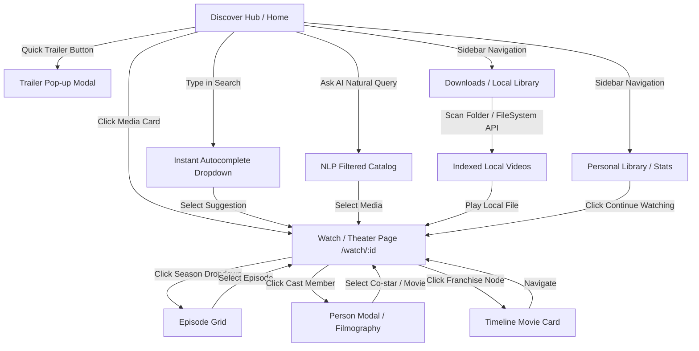

# Navigation Map & State Flow

**Date**: 2026-08-22  
**Purpose**: Map all navigational transitions, state preservation, and player handoffs.

---

## 1. Flow Diagram

---

## 2. State Preservation Rules
- **Scroll Position**: Preserved across route transitions using Next.js layout retention.
- **Search Query & Filters**: Synchronized with URL query parameters (`?q=...&genre=...&era=...&sort=...`) for shareable, bookmarkable deep links.
- **Watch History & Progress**: Debounced to client IndexedDB every 5 seconds during active playback.
- **Active Local Files**: Stored in session memory blob cache (`LocalScanner`) to avoid re-prompting file permissions during the same browsing session.
